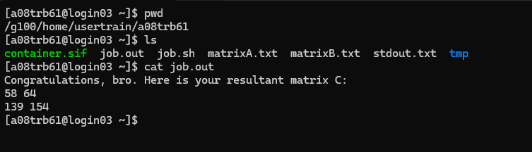

## Devops project part 2 - Software For High Performance Computing Engineering

### Overview

This project is designed to practice and enhance your skills in automating testing and building processes, containerization, and the usage of HPC (High-Performance Computing) clusters through SLURM. The exercise involves setting up and testing a DevOps pipeline for a matrix multiplication parallel software.

### Content

The repository contains the following components:

- CI/CD Pipeline (.github/workflows/): Automated processes that trigger on file pushes to the repository, executing build and test procedures, as well as creating the container, sending it to the cluster and executing.
- Singularity Container Descriptor (Singularity.def): Definition for building a Singularity image for the matrix multiplication program.
- Job Submission Script (job.sh): Script to run the containerized application and automation for executing the job on the Galileo100 cluster, all managed through GitHub Actions.
  Repository Structure
- src/: Source code for the matrix multiplication parallel software.
- test/: Testing with googletest for the application
- README.md: Project documentation.

### Getting Started

##### Prerequisites:

- GitHub Account: Required for accessing the repository and triggering GitHub Actions.
- Galileo100 Cluster Access: Necessary for transferring and executing jobs on the cluster.
- Singularity: Installed on your local machine for container testing and building.

### Usage

1. Clone the repo

   ```
   git clone https://github.com/abrilcano/SW.git
   cd SW

   ```
2. Set Up GitHub Secrets:
   Configure the following secrets in your GitHub repository settings:

   - USERNAME: Your username for the Galileo100 cluster.
   - HOST: The hostname for the Galileo100 cluster.
   - PASSWORD: Your SSH private key for accessing the cluster.
3. Run the CI C++ action 

### CI Workflow with Github Actions

##### Build

This job centers only on building, running and testing the matrix matrix multiplication

##### Build-Container

This job performs the building of the container, then sends it to the Galileo100 Cluster along with the necessary files
and triggers the execution of the job.sh that runs the containerized application.

### Results

After successfully completing the previous steps we can check the result of the execution accessing directly the cluster and seeing the defined output files with the expected behaviour.


